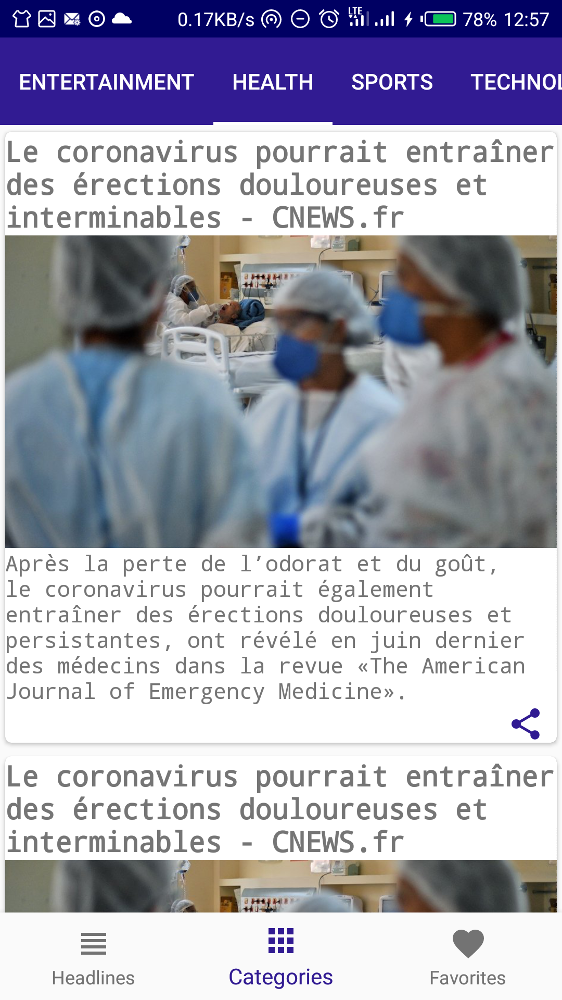
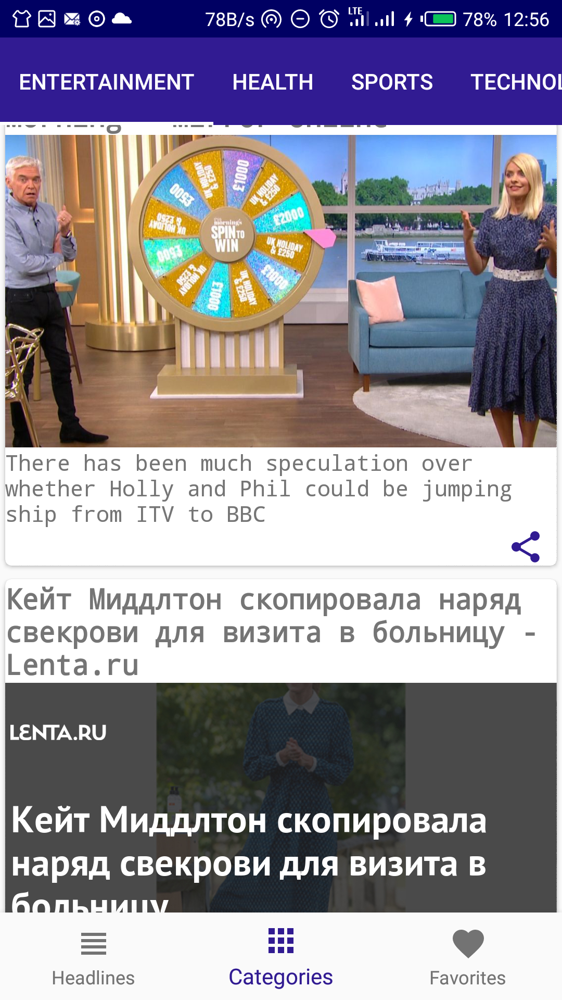
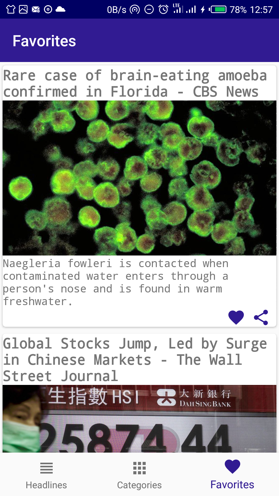

# MyProjects
Portfolio Projects

# PopularMovies-MVVM-JAVA
This app allow users to search for popular and top-rated movies from [theMoviedb.org](https://www.themoviedb.org/). User can view trailers, movie reviews, overview and like movies to view offline

## Features
* User can view  most popular and most rated movies
* User can view and play trailers on youtube
* show list of reviews for each movie
* Shows movies overview
* MVVM android-architecture with Room, ViewModel,Livedata,Rxjava
* ViewBinding,ConstraintLayout

[Source Code](https://github.com/kulloveth/PopularMovies)

<table>
<tr>
<td>

 

 </td>
 <td>

 

 </td>

   <td>

  </td>
  <td>
  
</td>
    </tr>
</table>

# LATESTNEWS-MVVM-JAVA
## Project Overview
This app provides you with news headlines happening around the world,with options to select specific country and news categories from [NewsApi.org](http://newsapi.org/)

# Features
* MVVM Android Architecture with Room Livedata and ViewModel
* Bottom Navigation with Jetpack Navigation Component
* Material Design Theme
* Networking with Retrofit
* ConstraintLayout
* ViewPager 2
* Users can search for any topic
* Users can check headlines from specific country or category
* User can share headline Url with friends
* User can mark a headline as Favorite and view offline

[Source Code](https://github.com/kulloveth/LatestNews)

<table>
<tr>
<td>

 

 </td>
 <td>

 

 </td>

   <td>

  </td>
 </tr>
</table>

<table>
<tr>
<td>

 

 </td>
 <td>

 

 </td>
    </tr>
</table>

  

 

